<div style="border:solid 4px #7349b7; border-radius:10px; background-color:#2960b22a; padding:15px;">

<h1 align="center" style="color:#7349b7; font-weight:bold;">
👋 Hi, I'm Koosha Sabzevari
</h1>

<div align="center">

</div>

<h3 align="center" style="color:#7349b7;">
AI Engineer | Python Developer | Machine Learning Enthusiast
</h3>

<h2 style="color:#7349b7;">🚀 About Me</h2>

```python
class Developer:

    def __init__(self):
        self.name = "Koosha Sabzevari"
        self.role = "AI Engineer & Python Developer"

        self.focus = [
            "Machine Learning",
            "Deep Learning",
            "Computer Vision",
            "LLM Applications",
            "Frontend Development"
        ]

        self.languages = [
            "Python",
            "JavaScript",
            "HTML",
            "CSS"
        ]

        self.currently_building = [
            "AI-powered applications",
            "Machine Learning projects",
            "Python automation tools"
        ]

        self.motto = "Keep learning. Keep building."


    def introduce(self):
        return f"""
        Name: {self.name}
        Role: {self.role}
        """

me = Developer()

print(me.introduce())
```

---

<h2 style="color:#7349b7;">🛠 My Tech Stack</h2>

<table align="center">

<tr>

<td align="center" width="96" height="65">

<br>Python
</td>

<td align="center" width="96" height="65">

<br>JavaScript
</td>

<td align="center" width="96" height="65">

<br>HTML5
</td>

<td align="center" width="96" height="65">

<br>CSS3
</td>

<td align="center" width="96" height="65">

<br>Scikit-Learn
</td>

<td align="center" width="96" height="65">

<br>PyTorch
</td>

<td align="center" width="96" height="65">

<br>TensorFlow
</td>

<td align="center" width="96" height="65">

<br>OpenCV
</td>

<td align="center" width="96" height="65">

<br>Docker
</td>

</tr>

</table>

<br>

<h2 style="color:#7349b7;">🔥 Most Used Languages</h2>

<div align="center">


</div>

<h2 style="color:#7349b7;">🌐 Let's Connect</h2>

<table align="center">
<tr>

<td align="center">
<a href="https://www.linkedin.com/in/koosha-sabzevari-3a6859222/" target="_blank">

</a>
</td>

<td align="center">
<a href="https://www.instagram.com/nonstop_coding/" target="_blank">

</a>
</td>

<td align="center">
<a href="https://t.me/itsKooshaSBZ" target="_blank">

</a>
</td>

<td align="center">
<a href="https://x.com/Koosha85675050" target="_blank">

</a>
</td>

</tr>
</table>


<br>

<div align="center">

<h3 style="color:#7349b7;">
⭐ Thanks for visiting my profile!
</h3>

</div>

</div>
